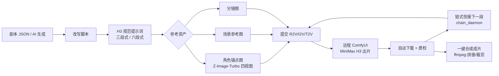

# AI漫剧H3生成工具 · 核心版（AImanju-core）

基于 **ComfyUI + MiniMax H3** 的自动化短剧/漫剧生产流水线（核心主链路精简版）：

**创建项目 → 剧本生成 → 改写脚本 → 规范提示词 → 参考资产 → 预览确认 → 提交生成 → 记录导出/一键合成**

控制台本体**零第三方依赖**（Python 标准库 + 原生单文件前端），仅工作流辅助脚本需要 Pillow、合成需要 ffmpeg。

> 完整文档（含截图）见主仓库：<https://github.com/chenchengchh/AImanju>
> 模型清单与安装方案见 [docs/MODELS.md](docs/MODELS.md)

## 核心主链路文件清单

```text
AImanju-core/
├── console/                      # Web 控制台（主链路核心，零第三方依赖）
│   ├── batch_console.py          # 主服务：项目/剧本/提示词/资产/提交/监控/合成（HTTP API + 前端服务）
│   ├── chain_daemon.py           # 链式生成守护进程（上段末帧 → 下段首帧，自动推进）
│   ├── index.html                # 前端界面（单文件，深色科幻主题，8 步流水线）
│   ├── start_daemons.py          # 一键启动 web + daemon（跨平台常驻）
│   └── rules/                    # AI 规则（可编辑热加载，主链路全部依赖）
│       ├── script_gen.md         # 剧本生成规则
│       ├── script_text.md        # 剧本文本规范
│       ├── script_rewrite.md     # 剧本改写规则
│       ├── h3_expand.md          # H3 提示词扩写规则
│       ├── h3_polish.md          # H3 提示词润色规则
│       ├── asset_prompt.md       # 资产生图提示词规则
│       ├── story_prompt.md       # 分镜提示词规则
│       └── failure_codes.md      # 失败码诊断速查表
├── workflows/                    # ComfyUI 工作流构建与视频处理
│   ├── build_api_graphs.py       # 核心：API 图谱构建（T2V/I2V/R2V + turbo 加速注入）
│   ├── r2v_api_template.json     # R2V（Ref2VA 多参考）API 模板
│   ├── i2v_api_template.json     # I2V（图生视频）API 模板
│   ├── minimax_h3_t2v_turbo.json # T2V turbo 工作流（ComfyUI 手动导入用）
│   ├── video_minimax_h3_r2v.json # R2V 完整工作流（手动导入用）
│   ├── video_minimax_h3_i2v_uncensored_enhancer.json  # I2V 无审查增强工作流（手动导入用）
│   ├── assemble.py               # 一键合成完整视频（拼接 + 裁剪起始音节）
│   ├── monitor_tasks.py          # 任务监控（轮询 /history）
│   ├── write_record.py           # 生成记录写入
│   ├── make_assets.py            # 参考资产工作流构建
│   ├── make_subtitles.py         # 字幕层生成（需 Pillow）
│   └── make_cta_layer.py         # CTA 引导层生成（需 Pillow）
├── scripts/
│   ├── check_env.py              # 一键环境检查（Python/ffmpeg/服务/模型逐项 ✅/❌）
│   └── start_windows.bat         # Windows 前台启动
├── examples/demo_script.json     # 演示剧本（第 2 步直接导入）
├── config.example.json           # 配置示例（复制为 config.json）
├── CONFIG.md                     # 配置项逐字段说明
├── requirements.txt              # Python 依赖（可选，仅辅助脚本）
└── LICENSE                       # MIT
```

## 主链路数据流



一句话：**控制台把「剧本 → 提示词 → 参考资产」编排好 → 提交远程 ComfyUI 用 H3 生成带原生立体声视频 → 自动下载质检 → 链式推进 → ffmpeg 合成成片**。

## 安装

### 1. 环境要求

- Python 3.10+（控制台零依赖）
- ffmpeg（视频合成/抽帧，需加入 PATH）
- ComfyUI（本机或远程，需装 MiniMax H3 节点与模型，见 [docs/MODELS.md](docs/MODELS.md)）

### 2. Python 依赖（仅辅助脚本需要）

```bash
pip install -r requirements.txt
```

### 3. 配置

```bash
cp config.example.json config.json
```

按 [CONFIG.md](CONFIG.md) 逐字段填写（ComfyUI 地址、LLM、生图）。**所有路径写相对路径。**

### 4. 一键环境检查

```bash
python scripts/check_env.py
```

### 5. 启动

```bash
cd console
python start_daemons.py        # 后台常驻（web + 链式守护）
# 或前台：python batch_console.py 8890
```

浏览器打开 <http://127.0.0.1:8890>

Windows 也可直接：`scripts\start_windows.bat`

## 使用流程（8 步）

1. **创建项目**：名称唯一，项目库可随时继续
2. **脚本生成**：剧情梗概 AI 生成分镜剧本，或粘贴剧本片段 / 导入剧本 JSON（演示：`examples/demo_script.json`）
3. **改写脚本**：AI 理顺动作衔接与对白逻辑（改写前后对照）
4. **规范提示词**：逐段扩写为 H3 三段式；R2V 提交时自动包装官方 Ref2VA 六段式
5. **参考资产**：资产状态表 → 角色四视图锚点图 / 场景图 / 分镜图（本地 Z-Image-Turbo 或云端），自动质检
6. **预览确认**：检查名称/时长/参考图/提示词完整性
7. **提交生成**：T2V/I2V/R2V 模式、步数 4-50（≤8 自动注入 turbo 加速）、链式衔接、实时监控
8. **记录导出**：版本批次记录、失败码速查、CSV 导出、一键合成完整视频

## 关键约定（改代码前必读）

- 角色服装/发型必须与资产状态表**一字不差**，提示词不得自行改写
- 失败先定位责任层（资产/镜头契约/提示词/平台/随机），每轮只改一个变量
- R2V 步数 ≤8 自动注入 TurboLoRA + SageAttention 加速；>8 走原生采样
- H3 R2V 推荐 6 步起步（turbo v4 官方下限），低于 6 步音频易发糊
- 详见 [docs/MODELS.md](docs/MODELS.md) 的模型约束章节

## License

MIT
