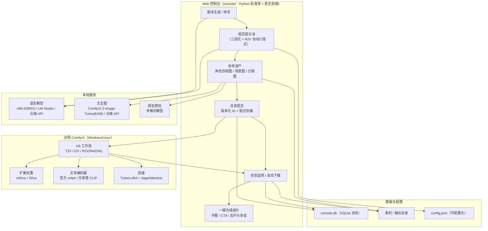
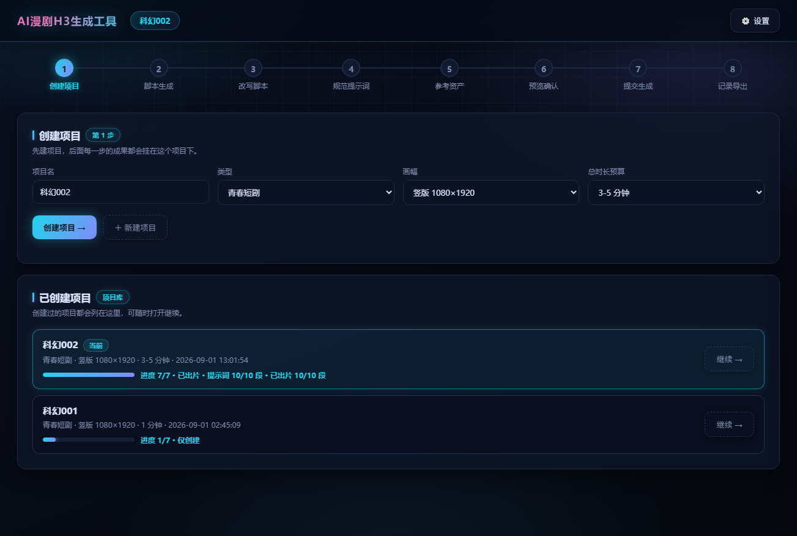
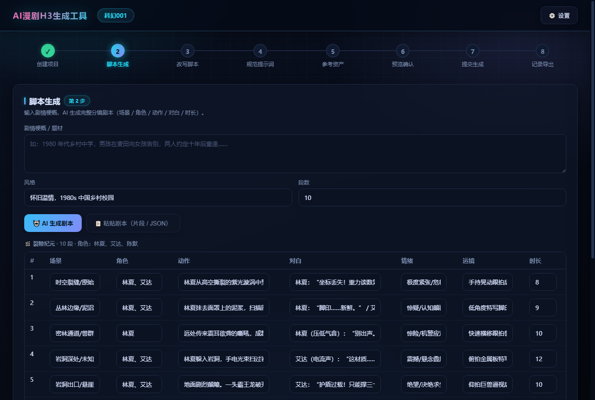
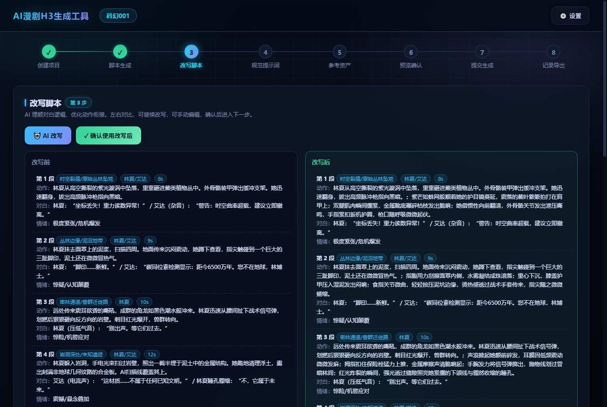
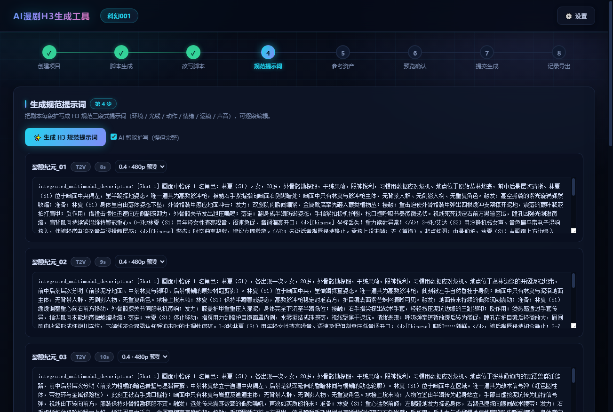
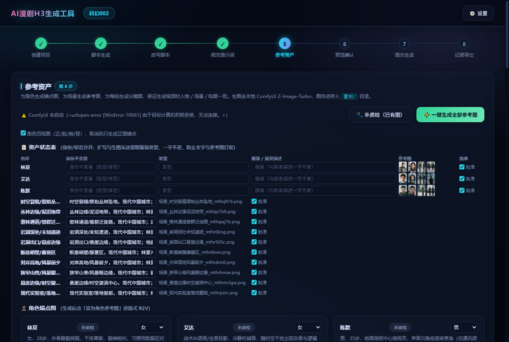
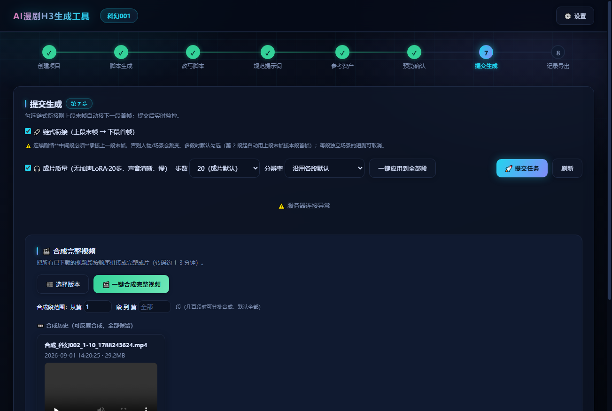

# AI漫剧H3生成工具

基于 **ComfyUI + MiniMax H3** 的自动化短剧/漫剧生产流水线：剧本生成 → 改写 → 规范提示词 → 参考资产（角色锚点图/场景图/分镜图）→ 批量视频生成 → 自动质检 → 一键合成成片。

控制台为**深色科幻风格**单页界面，本体**零第三方依赖**（Python 标准库 + 原生前端），生成走远程 ComfyUI（H3 ref2va），文本走本地 LM Studio / 云端 API（可切换），图片走本地 ComfyUI Z-Image-Turbo / 云端 API（可切换）。

> 本项目为演示/教学用途。模型输出质量受提示词与工作流配置影响，请勿用于任何违法违规内容。

## 系统架构



**链路一句话**：控制台把「剧本 → 提示词 → 参考资产」编排好，提交到远程 ComfyUI 用 H3 生成带原生立体声的视频，自动下载回本地合成成片；语言模型 / 文生图 / 质检全部支持本地与云端切换。

## 目录结构

```text
comfyui项目/
├── console/                  # Web 控制台（Python 标准库 + 原生前端，零第三方依赖）
│   ├── batch_console.py      # 主服务：项目/剧本/提示词/资产/提交/监控/合成
│   ├── chain_daemon.py       # 链式生成守护进程（自动推进下一段）
│   ├── index.html            # 前端界面（单文件，深色科幻主题）
│   ├── rules/                # AI 规则（剧本/扩写/生图提示词，可编辑热加载）
│   └── start_daemons.py      # 一键启动 web + daemon（跨平台）
├── workflows/                # ComfyUI 工作流模板与构建/合成脚本
├── scripts/                  # 环境检查 / 备份
├── examples/                 # 演示剧本
├── docs/                     # 文档截图（界面预览）
├── config.example.json       # 配置示例（复制为 config.json）
├── CONFIG.md                 # 配置说明
├── requirements.txt          # Python 依赖（可选，用于部分脚本）
└── LICENSE                   # MIT
```

## 功能一览

- 📜 **剧本流水线**：粘贴剧本片段 / 导入剧本 JSON → AI 生成或改写分镜剧本
- ✍️ **规范提示词**：按 MiniMax H3 官方规范生成提示词（对白 `(S1)/(S2)` 说话人 ID、音色锁定、防穿帮负向约束）；提交带参考图的 R2V 任务时自动包装官方 Ref2VA 六段式（subject_definitions / summary / retention_analysis …）
- 🖼️ **参考资产**：一键生成角色四视图（正/脸/侧/背）/ 场景图 / 分镜图，自动质检（人数、服装、穿帮），支持对话修改提示词后重新生成
- 🚀 **批量生成**：T2V / I2V / R2V（多参考）模式，链式衔接（上段末帧接下段首帧），步数 4-50 可调（≤8 自动加速）
- 🎬 **合成成片**：自动拼接 + 自动裁剪 H3 开头"起始音节"（消除每段开头的杂音）
- 🩺 **失败码体系**：生成失败自动打码定位（F-SUBMIT-API / F-TIMEOUT / F-COUNT …）

## 界面截图

深色科幻风格控制台，8 步流水线一步一屏：

| 创建项目 / 项目库 | 脚本生成 |
|---|---|
|  |  |

| 改写脚本（前后对照） | 规范提示词 |
|---|---|
|  |  |

| 参考资产（锚点图/场景图/分镜图） | 提交生成 / 合成成片 |
|---|---|
|  |  |

## 快速开始

### 1. 环境要求

- Python 3.10+（控制台零第三方依赖；工作流演示脚本需要 `pip install -r requirements.txt` 的 Pillow）
- ffmpeg（视频处理）
- 远程或本机 ComfyUI（需安装 MiniMax H3 工作流，见下方"远程依赖"）
- 文本模型：本地 LM Studio / Ollama（OpenAI 兼容）或任意云端 API
- 生图服务：本地 ComfyUI Z-Image-Turbo（默认 `http://127.0.0.1:8188`）或云端 API

### 1.5 一键环境检查

```bash
python3 scripts/check_env.py
```

脚本会检查：Python 版本、ffmpeg、config.json、远程 ComfyUI、语言模型（本地/云端）、文生图（本地/云端）、视觉质检，逐项输出 ✅/❌ 并给出修复建议。

### 各平台安装命令

**macOS（Apple Silicon）**

```bash
# ffmpeg
brew install ffmpeg
# 演示脚本依赖（控制台本体零依赖）
python3 -m pip install -r requirements.txt
```

**Windows**

```bat
winget install ffmpeg
winget install Python.Python.3.12
python -m pip install -r requirements.txt
```

> 各平台本地生图统一走 ComfyUI Z-Image-Turbo（需 ComfyUI 已装 Z-Image 模型）；未部署 ComfyUI 时用云端：`config.json -> image_gen.provider: cloud`

**Linux**

```bash
sudo apt update && sudo apt install -y ffmpeg python3 python3-pip
python3 -m pip install -r requirements.txt
```

> Linux 同样走本地 ComfyUI Z-Image 或云端生图。

### 2. 配置

```bash
cp config.example.json config.json
```

按 [CONFIG.md](CONFIG.md) 填写（服务器地址、模型、云端 API Key）。**所有路径写相对路径，禁止绝对路径。**

### 3. 启动控制台

```bash
cd console
python3 start_daemons.py        # 后台常驻（web + 链式守护）
# 或前台运行
python3 batch_console.py 8890
```

浏览器打开 <http://127.0.0.1:8890>。

## 使用流程（8 步）

1. **创建项目**（名称唯一，项目库显示在下方，支持继续）
2. **脚本生成**：填剧情梗概 AI 生成，或粘贴剧本片段 / 导入剧本 JSON
3. **改写脚本**：AI 从编剧角度理顺人物动作、情节流畅性（改写前/后对照）
4. **生成规范提示词**：逐段扩写成 H3 提示词（可手动编辑，可继续改写；R2V 提交时自动转六段式）
5. **参考资产**：资产状态表（身份/发型/服装/批准）→ 生成锚点图/场景图/分镜图 → 自动质检
6. **预览确认**：检查名称/时长/参考图/提示词完整性
7. **提交生成**：模式 / 分辨率 / 步数 / 链式衔接 / 成片质量可选，实时状态监控
8. **记录导出**：生成记录（版本批次）、失败码速查、CSV 导出、一键合成

演示数据见 [examples/demo_script.json](examples/demo_script.json)（可直接在第 2 步"导入剧本 JSON"）。

## 远程依赖（ComfyUI 需安装）

| 组件 | 说明 |
|---|---|
| MiniMax H3 节点 | `Comfy-Org/MiniMax-H3`（ref2va 工作流） |
| H3 模型 | `minimax_h3_ref2va_pruned_int8_convrot.safetensors` 等 |
| 加速节点 | `MiniMaxH3TurboLoRA` + `MiniMaxH3MemoryEfficientSageAttentionPatch`（步数 ≤8 自动启用） |
| CLIP | 官方 `qwen3vl_32b_minimax_h3_nvfp4_awq.safetensors`（开源默认）；个人本地可换未审查版 |

> **R2V 权重说明**：`r2v.unet` 必须是官方 Ref2VA 权重（与 T2V/I2V 的 FL2VA 是两套模型）。
> 系统提交 R2V 时自动检测服务器上是否已加载该权重，缺失则回退 FL2VA 并在界面提示（身份锁定弱）。
> 模型文件放远程 `models/diffusion_models/` 后重启 ComfyUI 生效。

工作流模板与构建脚本在 `workflows/`。

## 本地服务（可选）

- **LM Studio**：`http://127.0.0.1:1234`，加载一个 OpenAI 兼容模型（如 `qwen3.6-27b-abliterated-mlx`）
- **ComfyUI Z-Image**：`http://127.0.0.1:8188` 本地生图（Z-Image-Turbo，模型放 ComfyUI models 目录）
- **视觉质检**：OpenAI 兼容视觉服务（如通义 qwen-vl），配置在 `config.json -> vision`

### Z-Image 本地生图模型

生图直接复用 ComfyUI（与视频生成同一实例），需 models 目录有：

- `diffusion_models/z_image_turbo_bf16.safetensors`（主模型）
- `text_encoders/qwen_3_4b.safetensors`（文本编码器，CLIPLoader type=lumina2）
- `vae/ae.safetensors`（VAE）

控制台按 `config.json -> image_gen.local` 的模型名通过 `/prompt` API 提交 Z-Image-Turbo 工作流并自动取回图片。
- 未部署 ComfyUI 或想用云端 → 直接切**云端生图**（见下）

### 云端模型切换（LLM / 文生图）

语言模型与文生图都支持本地 ↔ 云端切换（`config.json` 或设置抽屉）：

```json
{
  "llm": {
    "provider": "cloud",
    "cloud": { "base_url": "https://api.deepseek.com/v1", "api_key": "sk-...", "model": "deepseek-chat" }
  },
  "image_gen": {
    "provider": "cloud",
    "cloud": { "base_url": "https://api.openai.com/v1", "api_key": "sk-...", "model": "gpt-image-1" }
  }
}
```

- 云端接口需兼容 OpenAI：LLM 走 `/v1/chat/completions`，文生图走 `/v1/images/generations`（支持 `b64_json` 或 `url` 返回）
- 主端点失败会自动降级到另一侧（本地↔云端互备）
- **不兼容 OpenAI 的服务用适配器**：LLM 支持 `provider_type: openai / claude / dashscope`（Claude 用 Messages API、通义用原生 DashScope，自动转换格式）；文生图支持 `openai / dashscope`（通义万相异步任务自动轮询）。设置抽屉里可选接口格式。

## Windows 部署

本项目完全兼容 Windows。本地生图与视频生成共用同一 ComfyUI 实例，差异仅在**后台常驻方式**：

### 1. 安装依赖

```bat
python -m pip install -r requirements.txt     :: 控制台本体零依赖，仅为演示脚本装 Pillow
```

另外安装 **ffmpeg**（加入 PATH）：视频转码/抽帧/合成都需要。推荐 winget：

```bat
winget install ffmpeg
```

### 2. 模型配置

- **语言模型**：Windows 可装 LM Studio（[lmstudio.ai](https://lmstudio.ai)，跨平台）加载本地模型；也可直接用云端（`config.json -> llm.provider: cloud`）
- **文生图**：Windows 上本地生图走 ComfyUI Z-Image-Turbo（本机或远程均可）；未部署 ComfyUI 时用云端：

```json
"image_gen": {
  "provider": "cloud",
  "cloud": { "base_url": "https://api.openai.com/v1", "api_key": "sk-...", "model": "gpt-image-1" }
}
```

- **ComfyUI**：Windows 上可直接跑远程或本机 ComfyUI（H3 节点），参考 `run_nvidia_gpu.bat`

### 3. 启动控制台

```bat
scripts\start_windows.bat          :: 前台运行（简单）
cd console && python start_daemons.py   :: 后台常驻（已做 Windows 兼容）
```

浏览器打开 <http://127.0.0.1:8890>。

> 说明：`start_daemons.py` 已跨平台（macOS/Linux 用 setsid，Windows 用 CREATE_NEW_PROCESS_GROUP）；
> 代码中所有路径均使用 `os.path` 拼接，Windows 中文路径/文件名正常。

## 联系作者

如有项目使用、二次开发、技术交流等需求，欢迎联系：

- **邮箱**：[chenchengchh@126.com](mailto:chenchengchh@126.com)

## ☕ 打赏

如果这个项目帮到了你，欢迎请作者喝杯咖啡（自愿，感谢支持）。


